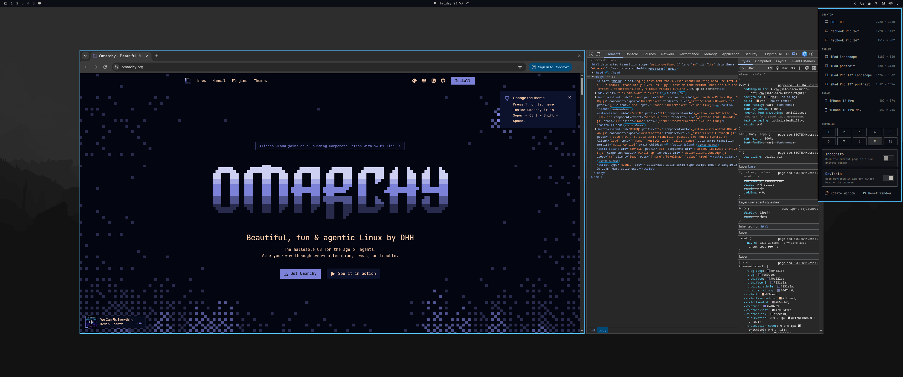

# Devframe

An [Omarchy](https://omarchy.org) bar widget for testing websites at real device sizes. Click the icon, pick a device, and the browser on your current workspace becomes a floating window of exactly that size, centered on the screen.



## Features

- **Device presets.** Sizes are logical (CSS) pixels, the size a browser on that device reports.

  | Preset | Size |
  |---|---|
  | Full HD | 1920 × 1080 |
  | MacBook Pro 16" | 1728 × 1117 |
  | MacBook Pro 14" | 1512 × 982 |
  | HD laptop | 1366 × 768 |
  | iPad (11") landscape / portrait | 1180 × 820 / 820 × 1180 |
  | iPad Pro 13" landscape / portrait | 1376 × 1032 / 1032 × 1376 |
  | iPad mini portrait | 744 × 1133 |
  | iPhone 16 Pro | 402 × 874 |
  | iPhone 16 Pro Max | 440 × 956 |
  | iPhone 16e | 390 × 844 |
  | iPhone SE | 375 × 667 |
  | Pixel 9 | 412 × 923 |
  | Galaxy S25 | 360 × 780 |

  The preset is the size of the whole browser window, toolbar included. In Chrome and Chromium the page itself gets 87px less height. The preset your browser is at right now is highlighted in the popup, and the bar icon's tooltip shows the current size.

  Presets that don't fit on your screen are dimmed in the popup. You can still pick one: the window then starts at the top-left corner of the screen, so the start of the page stays visible, and a notification says part of it is off-screen.

- **Phone sizes.** Chrome can't make a normal window narrower than 500px. For the iPhone presets, Devframe opens the current page in a new toolbar-less window (`--app` mode), so the page gets the full phone size. Logins carry over, and DevTools still work. On a page that scrolls, the desktop scrollbar takes 15px of the width, where a real phone overlays it.
- **Incognito.** With the switch on, any preset opens the current page in a new private window at that size instead of resizing your window.

  Phone and incognito windows open in the same browser as the window you started from. With no browser window on the workspace, they open in your default browser.
- **DevTools.** With the switch on, DevTools opens in its own window next to the browser, and the two are centered together. Choose where it goes under the switch:
  - **Left** or **Right:** at the browser's height, up to 900px wide.
  - **Below:** at least as wide as the browser (720px minimum), and as tall as the screen allows, up to 600px.

  When you switch tabs, DevTools switches to the new tab.
- **Workspace.** Buttons 1–10 move the browser and its DevTools to that workspace and take you there, like Super+Shift+number.
- **Rotate.** Swaps the window between portrait and landscape, keeping its DevTools in place. A normal browser window can't be narrower than 500px, so a window only rotates if the new width is at least that; phone windows always rotate.
- **Capture.** Takes a screenshot of just the browser window at its device size, the way Omarchy's own screenshots work: saved to your Pictures folder as `devframe-<width>x<height>-<date>.png`, copied to the clipboard, and announced with a notification you can click to edit it.
- **Reset.** Tiles the browser back into the layout, closes its DevTools, and closes phone windows.
- **Custom presets.** Add your own sizes, see below.

The Incognito and DevTools switches, and the DevTools position, are remembered across restarts. They're saved on the Devframe entry in `~/.config/omarchy/shell.json`.

## Install

```bash
omarchy plugin add https://github.com/ugurcanbulut/omarchy-devframe.git --enable
```

The widget is added to the right section of the bar. To move it:

```bash
omarchy bar move ugurcanbulut.devframe --section right --index 0
```

To open the popup from a key binding, bind it to `omarchy-shell ugurcanbulut.devframe toggle`.

## Custom presets

Add a `presets` list to the Devframe entry in your bar layout in `~/.config/omarchy/shell.json`. Changes show up as soon as you save the file.

```json
{ "id": "ugurcanbulut.devframe",
  "presets": [
    { "label": "Pixel 9", "width": 412, "height": 915, "group": "PHONE" },
    { "label": "Small laptop", "width": 1366, "height": 768, "group": "LAPTOP" },
    { "width": 2560, "height": 1440 }
  ] }
```

- `width` and `height` are required, in logical (CSS) pixels.
- `label` is optional. Without it, the preset is named after its size.
- `group` is optional. A preset in `DESKTOP`, `TABLET` or `PHONE` joins that section after the built-in presets. Any other group gets its own section, and presets without a group go under `CUSTOM`. The groups `DESKTOP`, `LAPTOP`, `TABLET` and `PHONE` get matching icons.

To show only your own presets, add `"builtInPresets": false` to the same entry.

## Requirements

- Omarchy 4 (Hyprland with Lua config)
- A Chromium-based browser. Devframe is tested with Chromium (Omarchy's default) and Google Chrome. Flatpak installs should work but are untested.
- `jq`, `socat`, `wtype` and `wl-clipboard`, all part of a standard Omarchy install

If something is missing, Devframe shows a notification saying what.

## Popup keyboard shortcuts

| Key | Action |
|---|---|
| `1`–`9` | Apply a preset |
| `h` `j` `k` `l` / arrows | Move the cursor |
| `Enter` / `Space` | Activate the selected item |
| `i` | Turn Incognito on or off |
| `d` | Turn DevTools on or off |
| `h` / `l` on the Left · Right · Below row | Pick where DevTools goes |
| `o` | Rotate |
| `s` | Capture a screenshot |
| `r` | Reset |
| `Esc` | Close |

Right-clicking the bar icon also turns Incognito on or off.

## Command line

The script behind the widget works on its own too, for example from your own key bindings. It lives at `~/.config/omarchy/plugins/ugurcanbulut.devframe/devframe`:

```bash
devframe 1920 1080 [--incognito] [--devtools[=left|right|below]]
devframe move 3
devframe rotate
devframe screenshot
devframe status
devframe reset
```

## How it works, and its limits

Chrome offers no way for a script to talk to an already-running browser, so Devframe drives it through Hyprland and keyboard shortcuts:

- **Reading the page address.** Phone and incognito windows need the current page's address. Devframe briefly copies it from the address bar and then puts your clipboard back. The address still shows up in your clipboard history, and rich text on the clipboard comes back as plain text.
- **Opening DevTools in its own window.** If your DevTools is docked, Devframe undocks it through the DevTools command menu. Reset docks it back. If you close the DevTools window yourself, Chrome keeps opening DevTools as a separate window until you dock it again (Ctrl+Shift+D inside DevTools).

  The command menu only understands commands in the browser's language, so Devframe does this automatically only when your browser runs in English. Otherwise it asks you to undock DevTools once by hand (DevTools ⋮ menu → Dock side → Undock into separate window). After that, it opens in its own window every time.
- **Following tabs.** Devframe watches the browser's window title, which changes when you switch tabs. As a result:
  - Switching between tabs with exactly the same title isn't detected.
  - Every switch opens a fresh DevTools for the new tab, so the old tab's console and network history are lost.
  - The inspect-element highlight can flash for a moment when a page changes its title.
- **Sending keys.** Devframe only sends keys while the browser window has focus.

## License

MIT
